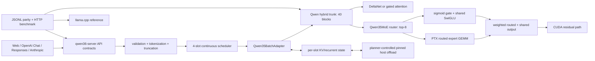

# Qwen3.6 35B-A3B MoE server implementation plan

**Date:** 2026-08-08  
**Priority:** P0  
**Source specification:** `docs/specs/2026-08-08-qwen36-35b-a3b-moe-server.md`

## Problem statement

Implement production text inference for `Qwen3.6-35B-A3B` GGUF (`general.architecture=qwen35moe`) in the existing Candle fork and the existing three-API server. The release target is Windows CUDA with four independent 81,920-token slots. RTX 3060 12 GB with `UD-IQ2_XXS` is the primary gate; RTX 4090 24 GB must run the complete five-quant matrix. Correctness, capacity, stability, API compatibility, and every llama.cpp-relative performance metric are independent mandatory gates.

## Current state

- `qwen35-batch/src/real/model_weights.rs:3654` builds a dense `qwen35` hybrid DeltaNet/attention trunk and assumes a dense `Mlp` in every `HybridBlock` (`qwen35-batch/src/real/model_weights.rs:3197`). It already contains single and batched state, snapshots, chunk-aware forward paths, and CUDA batched decode.
- `qwen35-batch/src/real/adapter.rs:40` connects that model to `BatchScheduler`, snapshots state after prefill, and seeds stable per-slot batched state.
- `qwen35-batch/src/scheduler.rs:62` currently sets `PREFILL_CHUNK=usize::MAX`; therefore the server does not yet provide bounded, interleaved prefill despite its scheduler interface already carrying `start_pos` and `reset_first`.
- `candle-transformers/src/fused_moe.rs:163` demonstrates packed GGUF routed experts, but lacks Qwen3.6 shared-expert semantics and its CUDA implementation routes through disabled static FFI.
- `candle-nn/src/moe.rs:1` gates the old MoE CUDA ABI behind `cuda_moe`; `candle-kernels/build.rs:14` excludes `moe_*.cu`, so normal dynamic-loading builds cannot execute it. Its quant mapping supports K-quants only, not the required IQ matrix.
- `/Volumes/Askid Dev/Projects/Qwen3.6 27B/src/main.rs:27` already selects single or batched engines before opening the listener. Its OpenAI Chat, OpenAI Responses, Anthropic Messages, `/v1/models`, SSE, auth, tools, vision rejection, and web chat are existing compatibility surfaces.
- `/Volumes/Askid Dev/Projects/Qwen3.6 27B/scripts/bench.ps1:1` measures a subset of required metrics but counts SSE text chunks as tokens and does not compare against llama.cpp or record machine-readable raw samples.

## Fixed implementation decisions

- Use PTX loaded through the existing `cudarc` dynamic-loading stack. Do not restore a production `libmoe.a` or hard-link `cudart`.
- Keep `qwen35moe` routing, GGUF names, routed/shared expert composition, and model validation in `qwen35-batch/src/real/moe.rs`. Put only model-neutral sparse CUDA operations and launchers in Candle.
- Add a load-time memory planner. Model-layer compute remains CUDA-only. The planner may place KV/recurrent/snapshot state in pinned host memory with bounded GPU staging. It must reject the requested four-slot profile before serving when no valid placement fits.
- Pin the server’s acceptance build to an exact commit on `origin/feat/qwen35-batching`; local development uses a Cargo patch rather than an absolute production path.
- Use matching JSONL diagnostic CLIs for Candle and a diagnostic llama.cpp build, plus a separate HTTP benchmark orchestrator for server metrics.
- Gate the new backend with compile-time `moe-cuda` and runtime `QWEN36_MOE_BACKEND=ptx|reference`. Dense architecture selection remains automatic. A production `qwen35moe` launch without PTX support or with an unsupported quant fails at startup; there is no hidden CPU-layer fallback.

## Target architecture



## Core contracts and data structures

### Model profile and validation

Add an immutable profile produced before heavy tensor loading:

```rust
struct ModelProfile {
    architecture: Architecture, // DenseQwen35 | Qwen35Moe
    block_count: usize,
    hidden_size: usize,
    context_length: usize,
    full_attention_interval: usize,
    routed_experts: usize,
    experts_per_token: usize,
    routed_intermediate: usize,
    shared_intermediate: usize,
    router_norm_topk: bool,
    quant_set: BTreeSet<GgmlDType>,
    fingerprint: ModelFingerprint,
}
```

`ModelProfile::read_and_validate(&gguf_file::Content)` must verify architecture, exact 40-block hybrid layout, top-8, all metadata values, every required tensor name, tensor rank/shape, quant type, byte range, and non-overlap before constructing the model. Errors include metadata/tensor name, expected value or shape, and actual value.

### Feed-forward abstraction

Replace dense-only `HybridBlock.mlp` with:

```rust
enum FeedForward {
    Dense(DenseMlp),
    Moe(Qwen35MoeBlock),
}

struct Qwen35MoeBlock {
    router: Linear,
    routed: PackedExperts,
    shared: SharedExpert,
    backend: MoeBackend,
    cfg: Qwen35MoeConfig,
}

fn forward(&self, xs: &Tensor, mode: ForwardMode) -> Result<Tensor> {
    let route = self.router.route_topk(xs, 8)?;
    let routed = self.backend.routed_swiglu(xs, &self.routed, &route, mode)?;
    let shared = self.shared.forward(xs)? * sigmoid(self.shared.gate.forward(xs)?)?;
    routed.broadcast_add(&shared)
}
```

`ForwardMode` distinguishes chunked prefill and batched decode without changing mathematical semantics. `reference` dequantizes only selected experts into bounded scratch and is permitted only for diagnostics/parity, never production acceptance.

### Universal CUDA sparse operation

Expose a Candle-level operation that owns validation, workspace sizing, PTX module lookup, and launch:

```rust
struct SparseMoePlan {
    tokens: usize,
    top_k: usize,
    num_experts: usize,
    input_dim: usize,
    output_dim: usize,
    quant: GgmlDType,
    workspace_bytes: usize,
}

fn quantized_expert_matmul(
    input: &Tensor,
    packed_weights: &QTensor,
    route: &RoutePlan,
    combine_weights: Option<&Tensor>,
    scratch: &mut MoeScratch,
) -> Result<Tensor>;
```

The operation supports decode and prefill, keeps routing IDs/offsets/weights on device, performs no `cudaMallocAsync` in the hot path, checks CUDA launch status, and supports `IQ2_XXS`, `IQ2_M`, `Q2_K`, `IQ3_XXS`, and `Q4_K` storage used by the required files. Actual tensor dtypes discovered during preflight, not filename suffixes, drive dispatch.

### State placement and compatibility

Add:

```rust
enum StatePlacement { Device, PinnedHost }
struct MemoryPlan {
    weights_bytes: u64,
    scratch_peak_bytes: u64,
    device_state_bytes: u64,
    host_state_bytes: u64,
    reserve_bytes: u64,
    per_layer: Vec<LayerPlacement>,
}
struct SnapshotIdentity {
    model_fingerprint: ModelFingerprint,
    runtime_layout_version: u32,
    context_limit: usize,
    state_dtype: DType,
    placement_signature: u64,
}
```

Snapshots use the stable model fingerprint and layout identity, not only the process-local `instance_nonce`. A bounded `PromptCacheStore` uses exact token-prefix keys, LRU byte budgeting, identity checks, and explicit miss reasons. GPU staging is preallocated and reused; state transfers are overlapped only after parity is established.

### Engine contract additions

Extend `ModelInfo` with architecture/backend/state-placement and expose load diagnostics. Preserve existing standard response fields. `truncated` remains in the API-specific usage/terminal structures already used by the server.

## Implementation phases

### Phase 0 — Reproducible fixtures and baseline capture (10–14 hours)

Status: partially complete (CLI, fixtures, and pinned llama.cpp diagnostic build done; dense baseline remains deferred)

Files:

- `qwen35-batch/src/bin/qwen36_inspect.rs` — new GGUF inspection CLI. ✅ implemented
- `qwen35-batch/tests/fixtures/qwen35moe_fixtures.json` — new fixture prompts for parity/benchmark/stability. ✅ implemented
- `qwen35-batch/tests/fixtures/qwen35moe_profile.json` — new expected metadata/tensor manifest derived from the real target GGUF. ⬜ deferred (requires GGUF on yttri-win)
- `/Volumes/Askid Dev/Projects/Qwen3.6 27B/scripts/bench.ps1` — preserve current dense baseline output before changing runtime. ⬜ deferred
- `/Volumes/Askid Dev/Projects/Qwen3.6 27B/Cargo.toml` and `Cargo.lock` — record current dependency state. ⬜ deferred

Tasks:

1. ✅ Inspector CLI implemented: reads GGUF via `candle_core::quantized::gguf_file`, emits JSON manifest (metadata, tensor names, ranks, shapes, dtypes, byte ranges, architecture fingerprint, overlap warnings, quant set). Compiles with `--features real-model,metal`.
2. ⬜ Capture dense RTX 3060 load, TTFT, prefill, decode, four-client behavior, VRAM, RAM, and existing test results — deferred (no GPU on current machine; run via SSH yttri-win).
3. ✅ Build pinned llama.cpp `8e7f22b67ef4667b4ddd50230771287f328cfb3f` on yttri-win with MSVC 19.44, CUDA toolkit 12.4, NMake, `CMAKE_CUDA_ARCHITECTURES=86`, `GGML_CUDA=ON`, `GGML_NATIVE=OFF`, and `LLAMA_CURL=OFF`; add exact-token JSONL logits probe under `qwen35-batch/tools/`.
4. ✅ Fixture prompts defined: short deterministic, multi-chunk prefill, tool call, near-context truncation (runtime-populated), snapshot reuse, batch shrink, four long-generation (12K tokens each).

Plan decisions:
- PD-001: `serde_json` added to `qwen35-batch` under `real-model` feature for manifest output.
- deviated: Tasks 2-3 deferred to yttri-win session; CLI structure and fixtures implemented first per user decision.

Independent exit check: the inspector deterministically reproduces the manifest (✅ code ready, ⬜ not yet run against real GGUF); baseline artifacts include commands and raw output (⬜ deferred); no runtime behavior has changed (✅ — only new files added).

### Phase 1 — Architecture profile and fail-fast GGUF validation (18–26 hours)

Files:

- `qwen35-batch/src/real/model_profile.rs` — new metadata/profile/fingerprint validation.
- `qwen35-batch/src/real/mod.rs` — export profile module.
- `qwen35-batch/src/real/adapter.rs:40` — run preflight before model allocation.
- `qwen35-batch/src/real/model_weights.rs:3400` — select dense versus MoE construction using the validated profile.
- `qwen35-batch/tests/model_profile.rs` — new metadata, tensor, shape, quant, and corruption tests.

Tasks:

1. Parse `general.architecture` and support only existing dense `qwen35` plus target `qwen35moe`.
2. Validate 40 blocks, hybrid interval, attention/DeltaNet dimensions, expert count, top-8, shared-expert dimensions, router semantics, context compatibility, and all tensor contracts.
3. Build a stable fingerprint from architecture metadata and tensor manifest; include file size and immutable GGUF identifiers, not the local path.
4. Aggregate validation failures where safe so startup reports all missing/incompatible properties at once.
5. Ensure validation completes before listener creation and before large CUDA allocations.

Independent exit check: real target manifest passes; synthetic missing/corrupt/shape/dtype variants fail with actionable errors; dense manifests still pass unchanged.

Covers: FR-001, FR-002, FR-015, part of FR-021.

### Phase 2 — Qwen-specific MoE reference path (24–34 hours)

Files:

- `qwen35-batch/src/real/moe.rs` — new router, packed-expert handles, shared expert, reference execution, diagnostics.
- `qwen35-batch/src/real/model_weights.rs:974` — rename dense `Mlp` to `DenseMlp`, introduce `FeedForward`, load MoE tensor groups, and call it in all three block paths.
- `qwen35-batch/tests/qwen35moe_reference.rs` — new routing/shared/composition tests.

Tasks:

1. Load packed routed expert tensors without dequantizing all experts and load router/shared tensors using exact manifest names.
2. Implement llama.cpp-compatible router transform, stable top-k tie behavior, top-8 selection, routing weight normalization/scaling, and deterministic diagnostics.
3. Implement routed SwiGLU and mandatory sigmoid-gated shared expert; combine them at the same residual location as llama.cpp.
4. Implement a bounded reference backend that handles small fixtures and selected tokens while preserving packed storage for the full model.
5. Add layer capture points for router logits, top-k IDs/weights, routed output, shared output, combined FFN output, and block output.

Independent exit check: synthetic experts with analytically known outputs pass; shared-expert gate 0/0.5/1 cases pass; chunked versus unchunked reference results meet the declared tolerance.

Covers: FR-003, FR-004, FR-005, foundation for FR-017 and FR-030.

### Phase 3 — Dynamic-loaded PTX MoE backend and required quant matrix (60–90 hours)

Status: in progress — target UD-IQ2_XXS and required five-file physical routed dtype matrix have direct F32 sparse kernels and CUDA parity tests. Grouped prefill is enabled for B>4 without global sort/workspace, while validated decode B=1..4 stays unchanged. PTX passes calibrated llama.cpp-relative teacher-forced logit gate, B=1/B=4 throughput, repeated long-prefill leak checks, and 4×8K stability. CUDA default is PTX for validated routed dtypes; `reference` remains explicit diagnostic rollback.

Files:

- `candle-kernels/src/moe_quantized.cu` — new PTX-compatible routed expert kernels; no CUDA Runtime API calls.
- `candle-kernels/src/moe_router.cu` — new device routing, stable top-k, histogram/prefix offsets, and combine kernels.
- `candle-kernels/src/lib.rs:5` — register PTX modules.
- `candle-kernels/build.rs:11` — compile the new non-FFI sources into generated PTX.
- `candle-core/src/quantized/cuda.rs` — expose safe packed quant storage metadata needed by sparse ops without leaking raw ownership.
- `candle-nn/src/moe.rs` — replace/augment static-FFI public path with model-neutral cudarc launchers, workspace cache, and typed errors.
- `candle-nn/Cargo.toml`, `qwen35-batch/Cargo.toml`, and workspace feature wiring — add `moe-cuda`.
- `candle-core/tests/moe_quant_cuda_tests.rs` — new kernel tests for all required physical dtypes and irregular routing.

Tasks:

1. Port dequant block math from the proven quantized kernels into sparse expert tiles for `IQ2_XXS`, `IQ2_M`, `Q2_K`, `IQ3_XXS`, and `Q4_K`; reuse shared lookup tables and block definitions rather than duplicate constants.
2. Keep route construction on GPU: stable top-8, sorted token/expert pairs, counts, exclusive offsets, and combine weights. Avoid host `expert_ids` and per-token synchronization.
3. Implement decode kernels optimized for 1–4 tokens and prefill kernels for bounded chunks; both consume packed expert storage directly.
4. Fuse gate/up activation where validated, then run down projection and weighted reduction. Keep an unfused debug variant behind `reference` diagnostics.
5. Precompute/reuse workspace per maximum chunk and four slots. Remove runtime allocation from repeated layer calls.
6. Add guards for alignment, block divisibility, shape, device, dtype, top-k, and workspace capacity; check launch errors at debug synchronization points.
7. Retire the production use of `candle-kernels/src/ffi.rs` MoE symbols and document old `candle-kernels/src/moe/` as reference-only until deletion after acceptance.

Progress:

- [x] Add direct packed sparse kernels for target routed dtypes `IQ2_XXS`, `IQ2_S`, and `IQ3_S`; keep activation F32 and avoid full expert dequantization.
- [x] Add Candle dispatch for single/dual projection calls; IQ gate/up currently uses two measured-faster launches on RTX 3060.
- [x] Fix GPU top-k normalization: all eight route weights now share one selected-weight sum.
- [x] Add CUDA projection parity for B=1/B=4, prefill-shaped B=5, shared-input layout, multiple expert IDs/rows/blocks, and single-vs-dual calls.
- [x] Add GPU router parity against stable CPU top-8 and normalized weights.
- [x] Run target GGUF smoke and warm benchmarks: B=1 PTX 9.13 vs reference 7.52 tok/s; B=4 PTX 21.09 vs reference 19.67 tok/s.
- [x] Establish llama.cpp-relative full-model logit policy. Pinned llama.cpp and Candle evaluate 128 identical teacher-forced states; full vectors at steps 16/45/50/92/111 must meet cosine ≥0.997, nRMSE ≤0.07, max abs ≤1.3. Up to 5 argmax differences are allowed only when external-reference margin ≤0.30. Exact greedy is diagnostic because both Candle backends differ from llama.cpp on low-margin decisions.
- [x] Run external llama.cpp parity: all three agree on 123/128 teacher-forced states; PTX matches llama.cpp on 2/5 disputed decisions and reference on 3/5. Free greedy exact prefix is PTX 43 tokens vs reference 16. PTX disputed-state nRMSE range 0.0272–0.0661; max abs ≤1.205.
- [x] Pass PTX 4×8K on RTX 3060: 4/4 HTTP 200, 8140 completion tokens each, total 8192, `finish_reason=length`, one `[DONE]`, no malformed JSON, bit-exact content, 1232.3 s elapsed, post-run reuse HTTP 200 in 1.71 s. GPU shared stayed 76 MiB; committed peak 11143 MiB; no CUDA/error markers.
- [x] Promote PTX as CUDA default only for routed dtype combinations supported by gate/up dual and down kernels; explicit `QWEN36_MOE_BACKEND=reference` remains rollback, invalid values and unsupported PTX dtypes fail at load.
- [x] Add grouped prefill for B>4: expert-grid kernel scans route tiles on device, uses 1 KiB static shared task storage, reuses each packed weight across up to eight matching routes, and needs no global sort/count/offset workspace.
- [x] Remove 8× prefill input materialization: indexed kernels consume shared `[tokens, 1, hidden]`; 256-token input workspace falls from about 16 MiB to 2 MiB.
- [x] Add required matrix kernels based on physical routed tensors: `IQ2_XS`, `IQ3_XXS`, and `IQ4_XS`; existing `IQ2_XXS`, `IQ2_S`, `IQ3_S`, and K-quant kernels complete the five-file matrix.
- [x] Pass CUDA projection suite (24/24), llama.cpp teacher-forced gate, six repeated 5779-token prefill cycles with zero steady memory spread, and grouped-path 4×8K regression.
- [ ] Run full-model correctness/performance/stability matrix for remaining GGUF files on RTX 4090.

Deviations:

- deviated: target UD-IQ2_XXS is physically mixed: routed tensors contain 80 `IQ2_XXS`, 37 `IQ2_S`, and 3 `IQ3_S`; implemented exact discovered set instead of filename-only `IQ2_XXS` dispatch.
- deviated: reused working runtime-loaded `quantized.cu` indexed operation instead of introducing another production launcher through incomplete `moe_quantized.cu`; one backend avoids duplicate ABI and lookup tables.
- deviated: exact greedy parity is no longer a correctness gate for this 2-bit backend. Pinned llama.cpp itself selects a mix of PTX and dequantize+cuBLAS low-margin decisions; teacher-forced numerical tolerance plus external margin is the promotion gate. PTX became CUDA default after 4×8K stability passed.
- deviated: reusable global route workspace was deleted from the design. Grouped prefill needs only static shared memory; a per-layer output workspace could retain roughly 1.2 GiB across 40 blocks and violate the RTX 3060 envelope. CUDA stream-ordered allocation handles short-lived output tensors.
- deviated: suffix-level quant names were replaced by header-derived physical manifests. Required files route through `IQ2_XXS/IQ2_S/IQ2_XS/IQ3_S/IQ3_XXS/IQ4_XS` plus existing `Q4_K/Q5_K/Q6_K`.

Independent exit check: kernel-level dequant/reference tests pass for every required physical dtype, including random routing, empty experts, all routes selecting one expert, decode B=1..4, prefill B=5/B=33, shared input, and route-tile boundary. Target IQ2_XXS passes long prefill, repeated leak, llama.cpp logits, and 4×8K gates on Windows CUDA 12.4. Remaining full-file checks stay blocked on RTX 4090/model availability.

Covers: FR-004, FR-006, FR-010, FR-011, FR-020, FR-030.

### Phase 4 — Integrate MoE into all hybrid forward modes (24–36 hours)

Files:

- `qwen35-batch/src/real/model_weights.rs:3197` — `FeedForward` in single decode, prefill, and `forward_decode_batch`.
- `qwen35-batch/src/real/moe.rs` — backend dispatch and scratch ownership.
- `qwen35-batch/src/real/adapter.rs:135` — model/profile/backend reporting and batched paths.
- `qwen35-batch/tests/real_qwen35_moe.rs` — new real-model smoke/parity tests.

Tasks:

1. Execute the identical MoE math after FFN norm in `HybridBlock::forward`, `forward_prefill`, and `forward_decode_batch`.
2. Pass explicit logical token positions and stable slot IDs only where stateful trunk layers need them; MoE itself remains stateless across requests.
3. Validate prefill chunk boundaries and decode batch compaction cannot change routing order or output association.
4. Add per-stage timing counters without synchronizing every layer in production.
5. Ensure model output metadata identifies `qwen3.6-35b-a3b`, architecture, backend, and actual quant set from GGUF.

Independent exit check: a complete GGUF loads and produces finite logits; B=1 batched decode equals single decode; B=4 equals four isolated deterministic runs within tolerance; dense tests remain green.

Covers: FR-003 through FR-006, FR-010, FR-011, FR-017, FR-021.

### Phase 5 — Bounded chunked prefill and continuous scheduling (22–32 hours)

Files:

- `qwen35-batch/src/scheduler.rs:62` — configurable bounded prefill quantum and decode-aware scheduling.
- `qwen35-batch/src/model.rs:54` — clarify chunk/state contract and progress reporting.
- `qwen35-batch/src/slot.rs` — track chunk progress and stable request binding.
- `/Volumes/Askid Dev/Projects/Qwen3.6 27B/src/engine_batched.rs:239` — admission, cancellation, timeout, and fair scheduling integration.
- `qwen35-batch/tests/scheduler_parity.rs` and `/Volumes/Askid Dev/Projects/Qwen3.6 27B/tests/api_test.rs` — chunking and concurrency regression tests.

Tasks:

1. Replace `usize::MAX` with a configurable safe default derived from the MoE workspace/memory plan; reject zero or oversized values.
2. Interleave one bounded prefill quantum with active decode so a long prompt cannot starve streaming slots.
3. Preserve `reset_first`, `start_pos`, first-token sampling, and exact chunk completion semantics.
4. Make `submit` return the actual admitted slot and bind the server request to that slot instead of assuming the first free binding index independently of scheduler state.
5. Harden cancellation and error paths so scheduler slot, server binding, sampler, snapshot, staging buffers, and counters are released exactly once.
6. Add fairness, queue saturation, batch shrink, slot reuse, disconnect, timeout, and error-injection tests.

Independent exit check: output is invariant across supported chunk sizes; an active decode stream progresses while another slot prefills; 1000 mock admission/cancel/reuse cycles leave all slots idle and counters zero.

Covers: FR-009, FR-010, FR-011, FR-016.

### Phase 6 — Four-slot memory planner, state offload, snapshots, and prompt cache (50–76 hours)

Files:

- `qwen35-batch/src/real/memory_plan.rs` — new estimator and placement solver.
- `qwen35-batch/src/real/state_store.rs` — new device/pinned-host per-slot state storage and staging.
- `qwen35-batch/src/real/prompt_cache.rs` — new bounded exact-prefix LRU.
- `qwen35-batch/src/real/model_weights.rs:2470` — abstract KV allocation/access behind state storage.
- `qwen35-batch/src/real/model_weights.rs:3152` — extend snapshot identity/layout and remove process-local nonce as the sole compatibility key.
- `qwen35-batch/src/real/adapter.rs:26` — slot placement, restore/seed/evict lifecycle.
- `/Volumes/Askid Dev/Projects/Qwen3.6 27B/src/config.rs` — memory budget/offload/cache configuration.

Tasks:

1. Compute weight, CUDA context, MoE scratch, DeltaNet state, attention KV, logits, staging, and safety reserve from the validated profile before full allocation.
2. Solve placement for four 81,920-token slots using free VRAM minus a configurable reserve. Prefer device state; offload KV first, then recurrent state only when required.
3. Allocate pinned host buffers once, use bounded layer staging, and keep all model-layer arithmetic on CUDA. Add transfer accounting and assertions preventing CPU layer fallback.
4. Replace per-chunk deep-clone snapshots with copy-on-write or owned state handles where possible; avoid simultaneously retaining single-slot snapshot, batched copy, and prompt-cache copy without a budget charge.
5. Add stable snapshot identity: model fingerprint, runtime layout version, context/state dtype, placement signature, and exact prefix tokens.
6. Implement bounded prompt-cache lookup, longest exact compatible prefix, LRU byte eviction, metrics, and explicit rejection for incompatible identity/layout.
7. Add per-slot reset from both device and host placements, including attention KV and DeltaNet state after cancellation/error.
8. Fail startup with a component-level memory report when the requested profile cannot fit.

Independent exit check: planner unit tests cover 12/24 GB profiles and impossible budgets; snapshot restore matches uncached logits; incompatible restores fail; repeated eviction/reuse has bounded RAM/VRAM; four near-limit state allocations respect the plan.

Covers: FR-009, FR-012, FR-014, FR-016, FR-030.

### Phase 7 — Server integration and three-API compatibility (20–30 hours)

Files:

- `/Volumes/Askid Dev/Projects/Qwen3.6 27B/Cargo.toml` and `Cargo.lock` — `moe-cuda` feature and reproducible commit pin.
- `/Volumes/Askid Dev/Projects/Qwen3.6 27B/src/config.rs` — backend, memory, prefill, cache configuration and validation.
- `/Volumes/Askid Dev/Projects/Qwen3.6 27B/src/engine_types.rs` — model/runtime metadata additions.
- `/Volumes/Askid Dev/Projects/Qwen3.6 27B/src/engine.rs` and `src/engine_batched.rs` — model profile, exact truncation, and error mapping.
- `/Volumes/Askid Dev/Projects/Qwen3.6 27B/src/api/openai.rs`, `responses.rs`, and `anthropic.rs` — contract regression only; preserve existing route behavior.
- `/Volumes/Askid Dev/Projects/Qwen3.6 27B/src/main.rs:20` — pre-listener preflight and startup report.
- `/Volumes/Askid Dev/Projects/Qwen3.6 27B/web/index.html` — show architecture/backend/state placement while retaining controls/history.
- `/Volumes/Askid Dev/Projects/Qwen3.6 27B/tests/api_test.rs` — expand contract matrix.

Tasks:

1. Require CUDA + `moe-cuda` for production `qwen35moe`; validate runtime backend and memory plan before binding the listener.
2. Expose model ID, architecture, actual quant(s), context, slots, modes, MoE backend, and offload policy through `/v1/models` and web chat.
3. Replace approximate per-message truncation with exact full-prompt token counting after each pair removal; preserve leading system messages and remove only complete oldest user/assistant pairs.
4. Verify `truncated: true` in non-stream and terminal/usage events for all three APIs without changing standard fields.
5. Preserve auth, SSE ordering/termination, stop behavior, tools, thinking blocks, usage, web controls/history, and HTTP 400 vision rejection.
6. Map queue-full to an explicit overload response and startup/model validation failures to process startup errors; never expose a partially loaded engine.
7. Pin acceptance builds to the exact Candle fork commit and document local `[patch]` usage without machine-specific absolute paths.

Independent exit check: API contract suite passes against mock and real MoE engine; all vision forms return 400; unauthorized requests remain 401; web chat displays MoE metadata and streams without duplicate/missing text.

Covers: FR-007, FR-008, FR-013, FR-015, FR-022, part of FR-021.

### Phase 8 — JSONL correctness and llama.cpp parity harness (32–48 hours)

Files:

- `qwen35-batch/src/bin/qwen35moe_parity.rs` — new Candle JSONL diagnostic CLI.
- `qwen35-batch/src/real/diagnostics.rs` — gated capture points and tensor statistics/dumps.
- `qwen35-batch/tests/parity_schema.rs` — JSONL schema and deterministic comparison tests.
- `/Volumes/Askid Dev/Projects/Qwen3.6 27B/scripts/parity_compare.ps1` — new runner/comparator.
- External diagnostic llama.cpp patch — maintained as a pinned patch file or branch with the same JSONL schema.

Tasks:

1. Define versioned JSONL records for run metadata, input tokens, layer/stage, shape, dtype, router top-k IDs/weights, tensor checksum/statistics, optional bounded values, final logits top-N, and generated tokens.
2. Add deterministic capture fixtures at embedding, hybrid layer output, router, routed expert, shared expert, combined FFN, final norm, and logits.
3. Instrument the pinned llama.cpp revision with the same record contract and stage naming.
4. Compare absolute/relative error, cosine similarity, top-k routing identity, final argmax, and greedy sequences. Store tolerances per stage/dtype in the harness and print the first divergence.
5. Require exact greedy matches only where the external-reference margin exceeds the calibrated ambiguity ceiling. For 2-bit MoE, use fixed teacher-forced states, locked numerical tolerances, and a maximum count of low-margin argmax differences; keep free greedy as an autoregressive amplification diagnostic.
6. Run chunk-size, B=1/B=4, snapshot restore, prompt-cache hit, batch shrink, and every required quant on available hardware.

Independent exit check: intentional perturbations at router/shared/KV stages are localized to the expected first divergence; unmodified implementations pass locked teacher-forced numerical and margin-aware argmax gates. Exact greedy is reported, not required, for low-margin 2-bit decisions.

Covers: FR-012, FR-017, FR-020, FR-030.

### Phase 9 — Machine-readable comparative benchmark and stability suite (28–44 hours)

Files:

- `/Volumes/Askid Dev/Projects/Qwen3.6 27B/scripts/bench.ps1` — correct token accounting and JSON output.
- `/Volumes/Askid Dev/Projects/Qwen3.6 27B/scripts/bench_compare.ps1` — new Candle/llama.cpp orchestrator and threshold evaluator.
- `/Volumes/Askid Dev/Projects/Qwen3.6 27B/scripts/stability_smoke.sh` or Windows-equivalent `stability.ps1` — four 8K–16K generations, RAM/VRAM sampling, lifecycle checks.
- `/Volumes/Askid Dev/Projects/Qwen3.6 27B/tests/acceptance_profiles.json` — benchmark profiles and required quant matrix.

Tasks:

1. Measure server-reported token counts rather than SSE chunk count. Capture load time, TTFT, prefill tok/s, single decode tok/s, four-slot aggregate and per-slot tok/s, peak VRAM, peak committed/RSS RAM, errors, and raw request timings.
2. Run Candle and llama.cpp sequentially on the same GPU with identical GGUF, prompts, warmup, context, slot count, output lengths, sampling, offload, power state, and repetition count.
3. Record JSON with commits, model fingerprint, quant, GPU, driver, CUDA runtime/toolkit, build flags, backend, memory plan, raw samples, median, spread, and comparison ratio.
4. Evaluate each metric independently. Throughput/latency/load/memory use direction-aware ratios; any value worse than llama.cpp by more than 10% fails the run.
5. Run four independent 8K, 12K, and 16K output profiles, with staggered admissions, EOS, cancellation, replacement admission, prompt-cache reuse, and post-run engine reuse.
6. Sample RAM/VRAM throughout and after cleanup; fail monotonic/unbounded growth, CUDA errors, deadlock/timeouts, missing terminal events, state leakage, or process death.

Independent exit check: the evaluator fails a synthetic 11% regression and passes exactly 10%; repeated runs produce complete JSON and all four streams terminate with correct usage.

Covers: FR-016, FR-018, FR-019, FR-020, FR-031.

### Phase 10 — Windows RTX 3060 production acceptance (20–30 machine hours plus fixes)

Files:

- Windows build/launch `.bat` scripts in the server repository or deployment workspace.
- Machine-readable artifacts under a run-specific output directory, not committed model data.

Tasks:

1. Build with MSVC environment, CUDA 12.4, `--release --features cuda,moe-cuda`; verify binary contains the PTX backend and starts in `ptx` mode.
2. Run unit/integration CUDA suites and dense regression suite.
3. Load `UD-IQ2_XXS`, verify fail-fast profile, memory plan, all APIs, `/v1/models`, tools, web chat, auth, SSE, truncation, cache, cancellation, and vision 400.
4. Run JSONL parity against llama.cpp.
5. Run the full four-slot 81,920 profile with four simultaneous 8K–16K generations.
6. Run comparative metrics and require every metric within 10% plus stable VRAM/RAM.
7. If any gate fails, return to the owning phase; do not reduce slots/context/output or change reference configuration to claim acceptance.

Independent exit check: one signed/dated RTX 3060 report contains all correctness, API, capacity, stability, memory, and comparative performance passes.

Covers: primary acceptance for FR-001 through FR-019 and FR-021 through FR-022.

### Phase 11 — RTX 4090 five-quant matrix and release closure (50–80 machine hours plus fixes)

Tasks:

1. Reproduce the exact pinned build and harness on RTX 4090 24 GB.
2. For `UD-IQ2_XXS`, `UD-IQ2_M`, `UD-Q2_K_XL`, `UD-IQ3_XXS`, and `Q4_K_M`, run phases 7–9 in full: server/API, parity, snapshot/cache, four-slot long generation, stability, memory, and every comparative metric.
3. Confirm memory planner decisions are recorded per quant and do not silently change the identical Candle/llama.cpp comparison policy.
4. Re-run dense Qwen3.5/Qwen3.6 smoke, scheduler parity, and server API suites on the release candidate.
5. Remove or clearly quarantine obsolete static MoE FFI only after all matrix runs pass; retain runtime `reference` solely for diagnostics.

Independent exit check: five complete passing reports plus RTX 3060 report; no waived metric, quant, capacity, or API scenario.

Covers: FR-019, FR-020, FR-021 and final release closure.

## Validation commands and gates

Exact commands must be finalized from repository scripts after implementation, but the plan requires these classes of checks:

- Local platform-independent: `cargo test -p qwen35-batch` and server API tests without CUDA.
- Windows CUDA build/tests through the established MSVC + CUDA 12.4 batch environment; never a bare SSH Cargo invocation lacking `cl.exe`.
- `candle-core` IQ and new MoE CUDA kernel tests for every required physical dtype.
- Real-model Candle parity CLI and pinned llama.cpp diagnostic CLI with identical fixture JSON.
- Server contract tests against all three APIs and web-chat smoke.
- Four-client long stability and memory telemetry.
- Comparative benchmark evaluator with per-metric 10% gates.

A phase cannot pass on a fallback backend when the phase claims PTX production readiness. Skips for unavailable hardware are allowed during development but remain blocking in phases 10–11.

## Requirement traceability

- FR-001: phases 1 and 7.
- FR-002: phase 1.
- FR-003: phases 2 and 4.
- FR-004: phases 2–4.
- FR-005: phases 2 and 4.
- FR-006: phases 3, 6, and 10.
- FR-007: phase 7.
- FR-008: phase 7.
- FR-009: phases 5–6.
- FR-010: phases 3–5.
- FR-011: phases 4–5.
- FR-012: phases 6 and 8.
- FR-013: phase 7.
- FR-014: phase 6.
- FR-015: phases 1 and 7.
- FR-016: phases 5–6 and 9–11.
- FR-017: phases 4 and 8.
- FR-018: phases 9–11.
- FR-019: phases 9–11.
- FR-020: phases 3, 8–9, and 11.
- FR-021: every phase’s dense regression gate, finalized in phases 10–11.
- FR-022: phase 7 and both hardware acceptance stages.
- FR-030: phases 2–4 and 8.
- FR-031: phase 9.

## Risks and mitigations

- RTX 3060 cannot hold four full 81,920 KV states plus weights: phase 6 makes placement a first-class preflight result and permits pinned-host state with bounded staging; an impossible plan fails startup rather than OOM later.
- Host offload transfer cost breaks the 10% gate: benchmark placement alternatives early, overlap staged transfers, retain hot layers/state in VRAM, and treat the gate as blocking rather than hiding the cost.
- IQ sparse kernels drift from llama.cpp: share block definitions/tables with Candle quantized kernels, establish reference tests per block and expert GEMM, then use stage-level JSONL localization.
- Top-k tie/order differences cause token divergence: implement stable deterministic ordering matching the pinned llama.cpp revision and test ties explicitly.
- Prefill route grouping scales poorly at long context: bounded chunks plus expert-grid route tiles avoid global sort workspace and keep scratch bounded.
- Snapshot copies exceed host memory: stable identity, byte-budgeted LRU, state handles/copy-on-write, and accounting for every retained copy.
- Existing scheduler/server bind different slot indices: phase 5 makes scheduler admission authoritative and adds lifecycle invariants.
- Absolute path dependencies make Windows builds irreproducible: exact git commit pin for acceptance and local Cargo patch only for development.
- Dense behavior regresses through shared abstractions: automatic architecture dispatch leaves `DenseMlp` and dense tensor names intact; dense tests are mandatory at each integration phase.
- Old static FFI accidentally re-enters production: `moe-cuda` PTX backend is explicit, startup reports backend, acceptance rejects `reference`, and static symbols remain unlinked.

## Dependencies and ordering

- The real target GGUF is required in phase 0 to eliminate metadata/tensor-name guesses.
- Phases 1–2 establish contracts and reference math before PTX optimization.
- Phase 3 must pass isolated quantized sparse kernels before phase 4 integrates the full model.
- Phases 5 and 6 follow correct full-model inference; scheduler and memory changes must not obscure initial numerical debugging.
- Phase 7 integrates the stable runtime into the server.
- Phase 8 correctness passes before performance promotion; phase 9 then optimizes and measures without changing semantics.
- RTX 3060 is the first production acceptance. RTX 4090 availability gates final five-quant release closure but does not block earlier development.

## Rollback strategy

- Compile without `moe-cuda` to recover the dense-only binary.
- For diagnostic comparison only, set `QWEN36_MOE_BACKEND=reference`; production acceptance requires `ptx`.
- Dense `qwen35` chooses `DenseMlp` automatically and never enters MoE code.
- Promote optimizations in small steps behind internal kernel variants until JSONL parity and benchmark gates pass; keep the previous passing PTX variant for one phase as an emergency rollback.
- A `qwen35moe` model never silently falls back to CPU model layers or dense FFN. Unsupported architecture, quant, memory plan, or backend is a startup error.

## Effort estimate

Engineering effort is approximately 308–460 hours plus 70–110 hours of hardware execution and any remediation discovered by acceptance. The dominant uncertainty is the PTX IQ sparse backend and the 12 GB four-slot memory/performance balance. The plan should be re-estimated after phases 0, 3, and 6 using measured tensor shapes, kernel throughput, and actual state sizes.

## Definition of done

- RTX 3060 `UD-IQ2_XXS` and RTX 4090 five-quant reports pass every mandated gate.
- High-margin greedy decisions match llama.cpp; low-margin differences stay within documented count/margin limits, and per-stage/final logit tolerances pass.
- Four slots expose 81,920 context and complete four simultaneous 8K–16K generations without state leakage or unbounded memory.
- Every load/TTFT/prefill/decode/concurrency/VRAM/RAM comparison is no more than 10% worse than llama.cpp under identical profiles.
- All three APIs, `/v1/models`, SSE, tools, auth, truncation, vision 400, and web chat pass compatibility tests.
- Dense Qwen3.5/Qwen3.6 tests and real-model smokes pass.
- Acceptance build is reproducible from pinned commits and records machine-readable artifacts.
