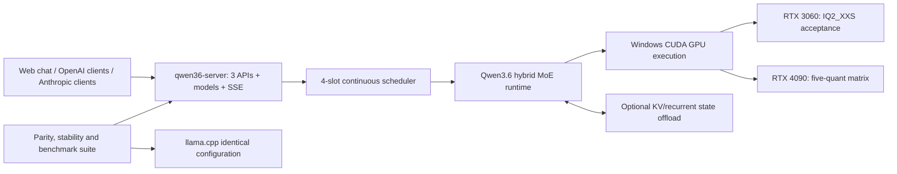

# Specification: Qwen3.6 35B-A3B MoE inference server

**Date:** 2026-08-08
**Priority:** P0
**Type:** Extension

## 1. Problem

The existing Qwen3.6 server and `candle-fork-qwen35-batch` runtime have not been validated with `Qwen3.6-35B-A3B` MoE models. Existing dense models run, but their observed inference speed is insufficient. The runtime lacks confirmed end-to-end support for the `qwen35moe` GGUF architecture, including routed experts, the always-active shared expert, multiple quantization formats, continuous batching, prompt-state reuse, and the complete three-API server surface.

The target system must provide a production-capable local server rather than a loader demo or isolated model prototype. It must preserve the established API and web-chat behavior of the Qwen3.6 27B server while supporting the MoE model under explicit correctness, capacity, stability, memory, and performance gates.

## 2. Goal

Extend the existing Candle runtime and Qwen3.6 server so that `Qwen3.6-35B-A3B` text-only GGUF models run through the complete server surface on Windows with CUDA. The primary acceptance target is `UD-IQ2_XXS` on RTX 3060 12 GB; an additional RTX 4090 24 GB validation matrix covers `UD-IQ2_XXS`, `UD-IQ2_M`, `UD-Q2_K_XL`, `UD-IQ3_XXS`, and `Q4_K_M`.

A release is successful only when model correctness, four-slot capacity, long-generation stability, full server compatibility, and comparative performance gates pass together.

## 3. Current state

- `qwen35-batch/src/real/model_weights.rs` implements the hybrid Qwen3.5/Qwen3.6 DeltaNet and gated-attention trunk, chunked prefill, decode, KV/recurrent state, snapshots, and batched state handling for dense feed-forward blocks.
- `qwen35-batch/src/real/adapter.rs` connects the real model to the continuous-batching scheduler and manages per-slot snapshots and batched-state seeding.
- `candle-transformers/src/fused_moe.rs` contains reusable packed-GGUF routed-expert behavior, but it has not been validated for the Qwen3.6 hybrid MoE architecture and does not provide the complete shared-expert behavior required by the target model.
- `candle-nn/src/moe.rs` and `candle-kernels/src/moe/` contain CUDA MoE paths for a limited set of GGUF quantization types; the current MoE CUDA path is not available in the normal dynamic-loading build.
- `candle-core/src/quantized/cuda.rs` supports general CUDA loading/dequantization of several IQ formats, including `IQ2_XXS`, but that does not establish sparse MoE execution or acceptable server performance.
- `/Volumes/Askid Dev/Projects/Qwen3.6 27B` contains the existing `qwen36-server`: OpenAI Chat Completions, OpenAI Responses, Anthropic Messages, `/v1/models`, SSE streaming, tools, web chat, authentication, context truncation, and benchmark/stability scripts.
- The existing server has been exercised with dense Qwen3.6 models, but the target 35B-A3B MoE model has not been run end to end.

## 4. User scenarios

### Scenario 1: Start a complete MoE server (P0)
**As** the server operator, **I want** to start the existing Qwen3.6 server with a supported 35B-A3B GGUF, **so that** all clients can use the MoE model without a separate server implementation.

**Steps:**
1. The operator configures a supported GGUF and starts the Windows CUDA server.
2. The server validates the model architecture and required capabilities before accepting traffic.
3. The server exposes the three API families, `/v1/models`, streaming, tools, and web chat with the selected model metadata.

**Acceptance criteria:**
- [ ] Given a supported GGUF and CUDA-capable build, when the server starts, then it loads the model and all established endpoints become available.
- [ ] Given a corrupt or incompatible GGUF, when the server starts, then startup fails before the listener accepts requests and the error identifies the incompatible model property.
- [ ] Given a vision payload, when any supported API receives it, then the server returns HTTP 400 without interrupting other requests.

### Scenario 2: Generate through all API surfaces (P0)
**As** an API client, **I want** identical model capabilities through OpenAI Chat Completions, OpenAI Responses, and Anthropic Messages, **so that** existing agents and tools continue to work unchanged.

**Steps:**
1. A client sends a normal or streaming request using one of the three API contracts.
2. The server performs prefill and streaming decode, including tool-calling behavior where that API supports it.
3. The client receives contract-compatible content, usage, finish state, truncation state, and tool output.

**Acceptance criteria:**
- [ ] Given equivalent prompts and deterministic sampling, when requests are sent through all three APIs, then their generated token content is semantically equivalent and each response follows its own wire contract.
- [ ] Given a streaming request, when generation proceeds, then the client receives valid ordered SSE events and a terminal event without duplicate or missing generated content.
- [ ] Given tools and supported tool selection, when the model selects a tool, then the response contains a valid tool call in the requesting API's format.
- [ ] Given a browser session, when the user opens the bundled web chat, then chat, thinking display, sampling controls, context progress, token speed, and browser-local history work with the MoE model.

### Scenario 3: Serve four concurrent long generations (P0)
**As** an operator with multiple agent clients, **I want** four independent slots with an 81,920-token limit, **so that** concurrent long-running workloads do not corrupt or block one another.

**Steps:**
1. Four clients establish independent conversations.
2. The scheduler prefills and decodes active slots continuously while slots enter, finish, and leave the batch.
3. Each slot retains only its own attention, recurrent, snapshot, and prompt-cache state.

**Acceptance criteria:**
- [ ] Given four active slots, when all four generate 8,000–16,000 output tokens concurrently, then all requests complete without process failure, CUDA failure, deadlock, unbounded RAM/VRAM growth, or cross-slot token/state leakage.
- [ ] Given one slot reaches EOS or is cancelled, when the active batch compacts, then the remaining slots continue with outputs matching their isolated deterministic runs within the documented tolerance.
- [ ] Given a reusable prompt prefix, when a slot restores a compatible snapshot or prompt-cache entry, then subsequent logits match an uncached execution within the documented tolerance.

### Scenario 4: Handle the 81,920-token context limit (P0)
**As** an API client, **I want** predictable context overflow behavior, **so that** long conversations remain usable across every API.

**Steps:**
1. A request would exceed the configured context limit.
2. The server preserves the system prompt and removes the oldest complete user/assistant pairs until the request fits.
3. The response reports that truncation occurred.

**Acceptance criteria:**
- [ ] Given a request exceeding 81,920 tokens, when it is admitted, then the system prompt is retained and only the oldest complete conversation pairs are removed.
- [ ] Given truncation occurs, when the response is emitted through any of the three APIs, then its contract exposes `truncated: true` without producing malformed standard fields or SSE events.
- [ ] Given four simultaneous near-limit contexts, when inference requires host-memory state offload, then all four slots remain correct and meet the same stability and performance gates.

### Scenario 5: Verify correctness and performance against llama.cpp (P0)
**As** the runtime developer, **I want** reproducible parity and benchmark comparisons, **so that** apparent model support cannot hide incorrect MoE behavior or unusable performance.

**Steps:**
1. Candle and llama.cpp run the same GGUF, prompts, sampling mode, context, slot count, offload policy, and output limits on the same GPU.
2. The test suite compares logits, greedy tokens, API behavior, capacity, memory, and server metrics.
3. Results are recorded per GPU and quantization format.

**Acceptance criteria:**
- [ ] Given deterministic parity fixtures, when Candle and llama.cpp run them, then greedy token sequences match and logits meet the documented numerical tolerance.
- [ ] Given identical benchmark configuration, when load time, TTFT, prefill throughput, single-slot decode throughput, four-slot aggregate/per-slot throughput, peak VRAM, and peak host RAM are measured, then no Candle metric is worse than the corresponding llama.cpp metric by more than 10%.
- [ ] Given either the capacity/stability gate or comparative performance gate fails, when release readiness is evaluated, then the target is marked failed rather than accepted under a reduced profile.

### Scenario 6: Validate the RTX 4090 quantization matrix (P0)
**As** the runtime developer, **I want** the complete server and validation suite exercised across larger quants on RTX 4090 24 GB, **so that** correctness, quality, capacity, and performance are known beyond the primary 12 GB configuration.

**Acceptance criteria:**
- [ ] Given RTX 4090 24 GB, when each of `UD-IQ2_XXS`, `UD-IQ2_M`, `UD-Q2_K_XL`, `UD-IQ3_XXS`, and `Q4_K_M` is selected, then the complete scenarios 1–5 are executed for that quant.
- [ ] Given RTX 4090 is not yet available, when RTX 3060 development and validation proceed, then the 4090 matrix remains a required external acceptance stage and its requirements are not silently waived.

## 5. Functional requirements

### Must Have (P0)
- **FR-001**: The runtime must recognize and validate the `qwen35moe` GGUF architecture required by Qwen3.6 35B-A3B.
- **FR-002**: The runtime must reject missing, corrupt, unsupported, or shape-incompatible required trunk and expert data before serving requests.
- **FR-003**: The runtime must execute the 40-block hybrid DeltaNet/gated-attention trunk with MoE feed-forward behavior in every block.
- **FR-004**: The runtime must select and combine the configured top eight routed experts per token using the model's routing semantics.
- **FR-005**: The runtime must execute and combine the always-active sigmoid-gated shared expert in every MoE block.
- **FR-006**: The runtime must support the target `UD-IQ2_XXS` model on Windows CUDA and preserve quantized expert storage within the accepted memory envelope.
- **FR-007**: The server must retain OpenAI Chat Completions, basic OpenAI Responses, Anthropic Messages, `/v1/models`, SSE streaming, tools, authentication, and bundled web chat behavior from the existing server.
- **FR-008**: `/v1/models` and the web chat must expose the active MoE model, quant, context limit, slot count, and supported modes.
- **FR-009**: The scheduler must support four independent concurrent slots with a configured 81,920-token context limit per slot.
- **FR-010**: The runtime must support chunked prefill and streaming decode without changing output semantics at chunk boundaries.
- **FR-011**: The runtime must support continuous batched decode while preserving stable slot identity during admission, EOS, cancellation, and compaction.
- **FR-012**: Snapshots and prompt-cache entries must preserve compatible attention/recurrent state and reject reuse across incompatible model identities or configurations.
- **FR-013**: Context overflow must preserve the system prompt, remove oldest complete conversation pairs, and expose `truncated: true` through all three APIs.
- **FR-014**: Host-memory offload of KV/recurrent state is permitted when required to satisfy four-slot capacity; CPU execution of model layers is not permitted as the production inference path.
- **FR-015**: The server must fail startup for a corrupt or incompatible target model rather than enter a partially functional serving state.
- **FR-016**: Four simultaneous 8,000–16,000-token generations must complete without crashes, deadlocks, memory leaks, or cross-slot state leakage.
- **FR-017**: Candle logits and greedy tokens must pass documented parity tolerances against llama.cpp under identical inputs and runtime configuration.
- **FR-018**: Load time, TTFT, prefill throughput, decode throughput, concurrent throughput, peak VRAM, and peak RAM must each be no more than 10% worse than llama.cpp under an identical configuration.
- **FR-019**: Release acceptance must require both the full capacity/stability gate and the full comparative performance gate; one may not compensate for failure of the other.
- **FR-020**: RTX 4090 validation must execute the full server, correctness, capacity, stability, and performance suite for `UD-IQ2_XXS`, `UD-IQ2_M`, `UD-Q2_K_XL`, `UD-IQ3_XXS`, and `Q4_K_M`.
- **FR-021**: Existing dense Qwen3.5/Qwen3.6 behavior and its automated tests must not regress.
- **FR-022**: Vision input must remain unsupported and return HTTP 400 without destabilizing the server.

### Should Have (P1)
- **FR-030**: Validation reports should retain per-layer or per-stage diagnostics sufficient to localize routing, routed-expert, shared-expert, state, or API divergence.
- **FR-031**: Benchmark reports should be machine-readable and include model identity, quant, GPU, driver/runtime, slot/context profile, offload policy, and raw samples.

## 6. Non-functional requirements

- **Correctness**: Numerical tolerances must be stated in the validation report; greedy tokens must match llama.cpp for deterministic fixtures.
- **Performance**: Every required server metric must be within 10% of llama.cpp under identical hardware, GGUF, prompts, context, slots, offload, and output lengths.
- **Capacity**: Four slots must each expose an 81,920-token limit and sustain four concurrent 8,000–16,000-token generations.
- **Reliability**: Acceptance runs must finish without process/CUDA failure, deadlock, invalid output, cross-slot leakage, or monotonic memory growth after requests complete.
- **Memory**: RTX 3060 validation must fit the `UD-IQ2_XXS` production path using GPU execution; host-memory state offload is allowed and must be measured. RTX 4090 runs must report both peak VRAM and peak host RAM for every quant.
- **Compatibility**: Production scope is Windows with CUDA. Existing HTTP API contracts and web-chat behavior remain compatible with the Qwen3.6 27B server.
- **Security**: Existing bearer master-key authentication and LAN-only deployment behavior remain unchanged.

## 7. Conceptual model

```text
Model Profile
  - architecture: qwen35moe
  - quantization: supported GGUF quant
  - context_limit: 81920
  - slot_capacity: 4
  - capabilities: text, thinking/instruct, tools

Inference Slot
  - stable_slot_id
  - conversation context
  - attention/recurrent state
  - optional compatible prompt snapshot
  - lifecycle: idle → prefill → decode → completed/cancelled → idle

Validation Run
  - model profile
  - hardware profile
  - identical Candle/llama.cpp configuration
  - correctness results
  - API/stability results
  - performance and memory metrics
```

No new persistent application database is introduced. GGUF files remain external model artifacts, logs and validation reports are operational outputs, and browser chat history remains in local storage.

## 8. System overview



## 9. Out of scope

- Vision encoder/projector and image/video inference.
- MTP or other speculative decoding.
- CPU model inference as a production backend.
- Metal support for the 35B-A3B MoE target.
- Independent DeltaNet performance optimization not required to satisfy this specification's end-to-end gates.
- Training, fine-tuning, expert parallelism, multi-GPU sharding, TLS, multi-key authentication, and per-key quotas.
- Replacing Candle with llama.cpp; llama.cpp is only the reference implementation for parity and benchmarks.

## 10. Deferred questions

| Question | Why deferred | When the answer is needed | Who decides |
|----------|--------------|---------------------------|-------------|
| None | — | — | — |

## 11. Spec decisions

| # | Question | Decision | Date |
|---|----------|----------|------|
| D-001 | What is the task type and priority? | P0 extension of the existing runtime and full server. | 2026-08-08 |
| D-002 | What constitutes the product result? | Complete inference through the existing three-API Qwen3.6 server and web chat, not an isolated model demo. | 2026-08-08 |
| D-003 | Which platform is required? | Windows CUDA only for this MoE scope; RTX 3060 12 GB is the primary target. | 2026-08-08 |
| D-004 | What capacity is mandatory? | Four slots with an 81,920-token limit and four simultaneous 8,000–16,000-token generations. | 2026-08-08 |
| D-005 | Is host offload allowed? | KV/recurrent state offload is allowed; CPU model-layer inference is not. | 2026-08-08 |
| D-006 | How is correctness judged? | Compare logits within documented tolerance and require matching greedy tokens against llama.cpp. | 2026-08-08 |
| D-007 | How is performance judged? | Every server metric must be no more than 10% worse than llama.cpp under identical configuration. | 2026-08-08 |
| D-008 | Which requirement wins if capacity and speed conflict? | Both are mandatory; failure of either fails acceptance. | 2026-08-08 |
| D-009 | What server compatibility is required? | Preserve all three APIs, `/v1/models`, streaming, tools, auth, context behavior, and web chat. | 2026-08-08 |
| D-010 | How is context overflow handled? | Preserve system prompt, remove oldest complete pairs, and expose `truncated: true` through all three APIs. | 2026-08-08 |
| D-011 | What happens for an incompatible GGUF? | Server startup fails before accepting requests. | 2026-08-08 |
| D-012 | What is the RTX 4090 role? | Additional mandatory full validation matrix, not a replacement for RTX 3060 acceptance. | 2026-08-08 |
| D-013 | Which RTX 4090 quants are required? | `UD-IQ2_XXS`, `UD-IQ2_M`, `UD-Q2_K_XL`, `UD-IQ3_XXS`, and `Q4_K_M`, each with the full suite. | 2026-08-08 |
| D-014 | What is explicitly excluded? | Vision, MTP/speculative decoding, CPU production inference, Metal target support, and standalone DeltaNet optimization. | 2026-08-08 |

## 12. Success criteria

- [ ] `Qwen3.6-35B-A3B-UD-IQ2_XXS.gguf` starts and serves through the complete existing server on RTX 3060 12 GB.
- [ ] All Must Have requirements FR-001 through FR-022 pass automated or documented hardware acceptance checks.
- [ ] Four concurrent slots complete 8,000–16,000-token generations at an 81,920-token limit without failures, leaks, or state contamination.
- [ ] Deterministic logits satisfy the documented tolerance and greedy tokens match llama.cpp.
- [ ] Every required performance and memory metric is within the 10% comparative threshold under identical configuration.
- [ ] Dense-model regression suites remain green.
- [ ] The RTX 4090 full suite passes for all five required quantization formats before final cross-quant acceptance is declared.
